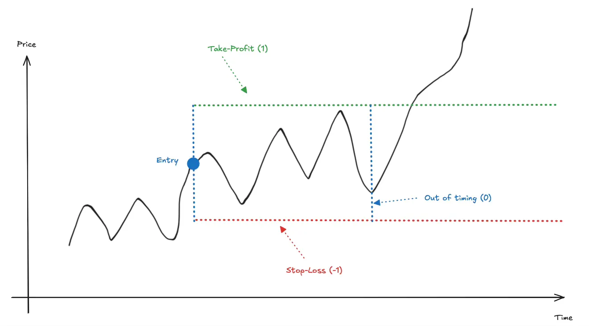

# Hummingbot MCP - Claude Code User Guide

This guide shows Claude Code users how to use the Hummingbot MCP server for cryptocurrency trading.

## Quick Start

Once the MCP server is configured, you can interact with Hummingbot using natural language. Claude Code has access to all trading tools automatically.

### Check Your Setup

```
Show me my portfolio overview
```

```
What exchanges do I have connected?
```

### Connect an Exchange

```
Help me connect my Binance account
```

The MCP server will guide you through the credential setup process.

---

## Trading with Bots

Bots are smart trading algorithms that handle order placement, position management, and risk controls. This is the primary way to execute trades.

> **Terminology Note**: In the MCP interface, "bots" refer to executors - lightweight trading algorithms. For advanced multi-strategy deployments, see [Controllers](#controllers-advanced) below.

### Bot Progression

| Level | Bot Type | Description |
|-------|----------|-------------|
| 1. Beginner | Order Bot | Simple order placement with retry logic |
| 2. Intermediate | Position Bot | Positions with automatic stop loss, take profit, time limit |
| 3. Advanced | Grid Bot, DCA Bot, TWAP Bot | Sophisticated multi-order strategies |
| 4. Pro | Arbitrage Bot, XEMM Bot | Multi-exchange strategies |

---

## Step 1: Your First Order (Order Bot)

Start with the simplest bot - place a market order:

**Buy BTC:**
```
Create an order bot to buy 0.001 BTC on Binance perpetual
```

**Sell ETH:**
```
Create an order bot to sell 0.1 ETH on Hyperliquid
```

The Order Bot:
- Places your order with automatic retry on failures
- Tracks order status
- Handles basic error recovery

---

## Step 2: Trades with Risk Management (Position Bot)

Once comfortable with basic orders, graduate to Position Bot for professional risk management.

### The Triple Barrier Method

Position Bot uses the **Triple Barrier Method**, invented by **Marcos López de Prado** (documented at https://www.quantresearch.org/Innovations.htm).



**The Three Barriers:**

| Barrier | Trigger | Label | Description |
|---------|---------|-------|-------------|
| Take-Profit | Price rises to target | +1 | Upper horizontal barrier (green) |
| Stop-Loss | Price falls to limit | -1 | Lower horizontal barrier (red) |
| Time Limit | Time expires | 0 | Vertical barrier (blue) |

The position automatically closes when ANY barrier is touched first.

### Position Bot Examples

**Long with stop loss and take profit:**
```
Create a position bot to buy 0.01 BTC on Binance perpetual with:
- 2% stop loss
- 4% take profit
- 24 hour time limit
```

**Short ETH with risk management:**
```
Open a short position bot on ETH-USDT with 0.1 ETH, 3% stop loss, 6% take profit
```

### Why Triple Barrier?

1. **Defined Risk**: Know your maximum loss before entering
2. **Automatic Execution**: No need to watch charts constantly
3. **Prevents "Forever Positions"**: Time limit closes stale positions
4. **Machine Learning Ready**: Clear labels (+1, -1, 0) for backtesting

---

## All Bot Types

| Bot | Description | Use Case |
|-----|-------------|----------|
| Order Bot | Single order with retry logic | Simple buy/sell |
| Position Bot | Position with Triple Barrier risk management | Directional trading |
| Grid Bot | Multiple orders at price levels | Range-bound markets |
| DCA Bot | Dollar-cost averaging entries | Gradual accumulation |
| TWAP Bot | Time-weighted order execution | Large orders |
| Arbitrage Bot | Cross-exchange arbitrage | Price discrepancies |
| XEMM Bot | Cross-exchange market making | Liquidity provision |

---

## Managing Bots

### List Active Bots

```
Show me all my active bots
```

```
List bots for BTC-USDT
```

### Get Bot Details

```
Show me details of bot abc123
```

### Stop a Bot

```
Stop bot abc123
```

```
Stop bot abc123 but keep the position open
```

### Get Summary Statistics

```
Show me my bot performance summary
```

---

## Quick Reference Commands

### Market Data

```
What's the price of BTC on Binance?
```

```
Show me the ETH-USDT order book on Hyperliquid
```

```
Get 1-hour candles for SOL-USDT
```

```
What's the funding rate for BTC perpetual?
```

### Portfolio

```
Show my balances
```

```
Show my open positions
```

```
Show my active orders
```

---

## Risk Management Guidelines

### Stop Loss / Take Profit Ratios

| Style | Stop Loss | Take Profit | Risk:Reward |
|-------|-----------|-------------|-------------|
| Conservative | 1% | 2-3% | 1:2-3 |
| Moderate | 2% | 4-6% | 1:2-3 |
| Aggressive | 3% | 9%+ | 1:3+ |

**Key Principle**: Take profit should exceed stop loss to be profitable over time, even with <50% win rate.

### Best Practices

1. **Start with Order Bot** - Master simple orders first
2. **Graduate to Position Bot** - Add risk management
3. **Always use stop losses** - Triple Barrier makes this easy
4. **Start small** - Test with small amounts before scaling
5. **Check balances** - Ensure sufficient funds before trading
6. **Monitor bots** - Use `list bots` to track positions

---

## Configuration

### Setting Leverage

```
Set leverage to 5x for BTC-USDT on Binance perpetual
```

### Position Mode

```
Set position mode to hedge on Binance perpetual
```

### View Bot Configuration Options

To see all configuration options:

```
Show me the configuration options for position bot
```

---

## Controllers (Advanced)

For more sophisticated trading strategies, Hummingbot provides **Controllers**.

**How Controllers Work:**
1. **Controller** = Strategy template (the code/logic, e.g., "pmm_simple", "bollinger_v1")
2. **Controller Configuration** = Parameters for that strategy (trading pair, spreads, amounts)
3. **Controller Instance** = Running deployment with one or more configurations

> **Terminology Note**: In the Hummingbot API, the "bot" endpoints manage controller instances. We call them "controllers" here to distinguish from the simpler executor-based bots above.

### When to Use Controllers

| Use Case | Recommendation |
|----------|----------------|
| Simple trades with risk management | Use Bots (Position Bot, Grid Bot, etc.) |
| Complex multi-indicator strategies | Use Controllers |
| Custom strategy logic | Use Controllers |
| Running multiple strategies together | Use Controllers |

### Available Controller Types

```
Show me available controllers
```

### Controller Examples

- **PMM (Pure Market Making)**: Provide liquidity with configurable spreads
- **Directional Trading**: Trade based on technical indicators
- **Cross-Exchange Market Making**: Arbitrage across exchanges

### Deploying a Controller

```
Help me deploy a market making controller
```

### Managing Controller Instances

```
Show me active controller instances
```

```
Stop controller instance xyz
```

---

## Troubleshooting

### "Cannot connect to API"

```
Check the Hummingbot API status
```

### "Exchange not configured"

```
Help me connect my exchange account
```

### "Insufficient balance"

```
Show my balances on Binance
```

### View Logs

```
Show me the logs for my active bots
```

---

## Terminology Reference

| Term | Description |
|------|-------------|
| **Bot** | User-friendly name for an Executor - a lightweight trading algorithm (order, position, grid, etc.) |
| **Controller** | Strategy template - the code and logic for a trading strategy |
| **Controller Configuration** | Parameters for a controller - the specific settings (trading pair, amounts, spreads, etc.) |
| **Controller Instance** | A running deployment with one or more controller configurations |

---

## Resources

- [Hummingbot Documentation](https://hummingbot.org/docs/)
- [Triple Barrier Method - Marcos López de Prado](https://www.quantresearch.org/Innovations.htm)
- [Hummingbot API Repository](https://github.com/hummingbot/hummingbot-api)
- [MCP Server Repository](https://github.com/hummingbot/mcp)
